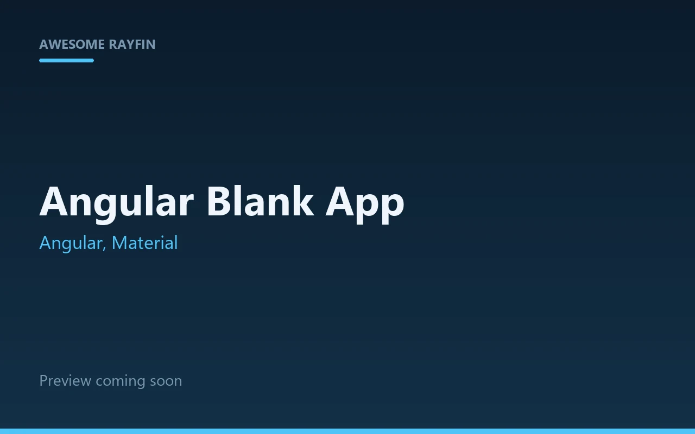
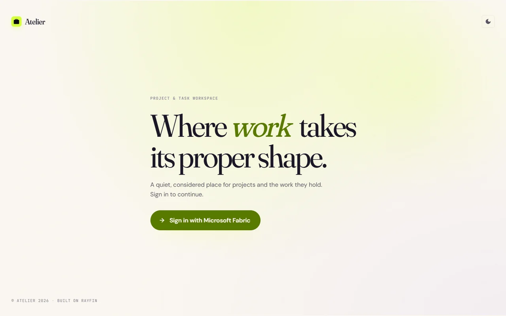
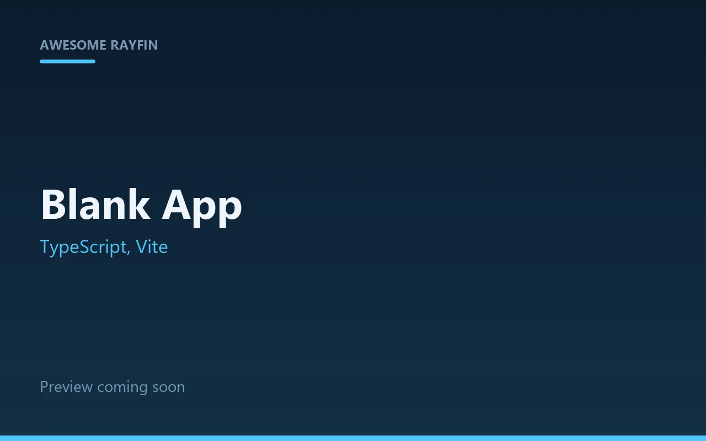
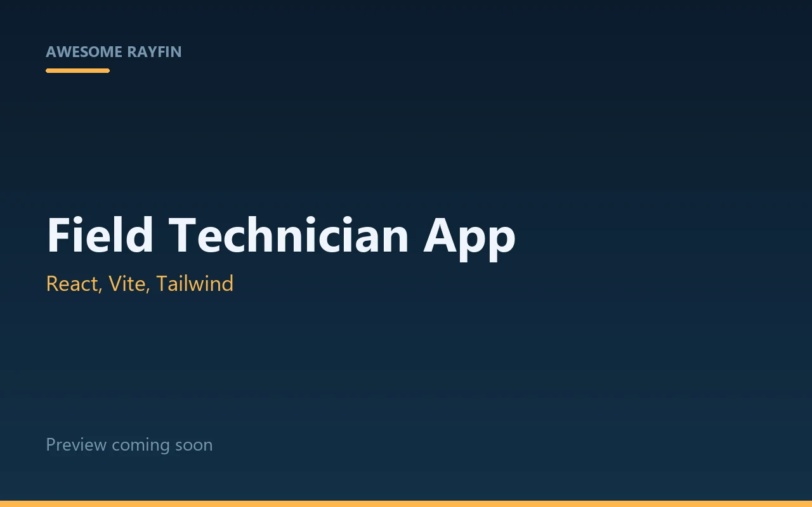
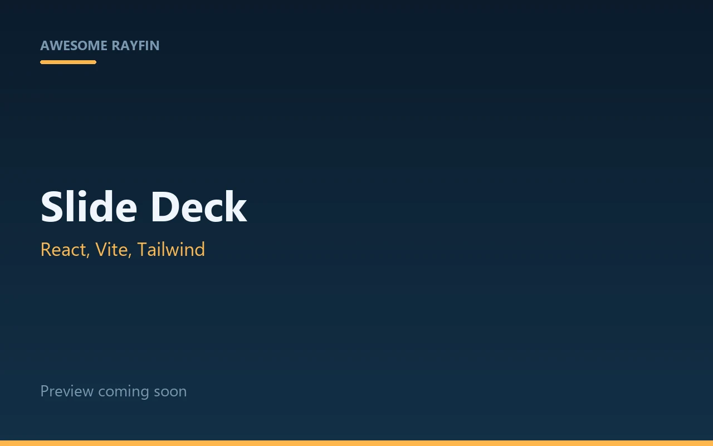
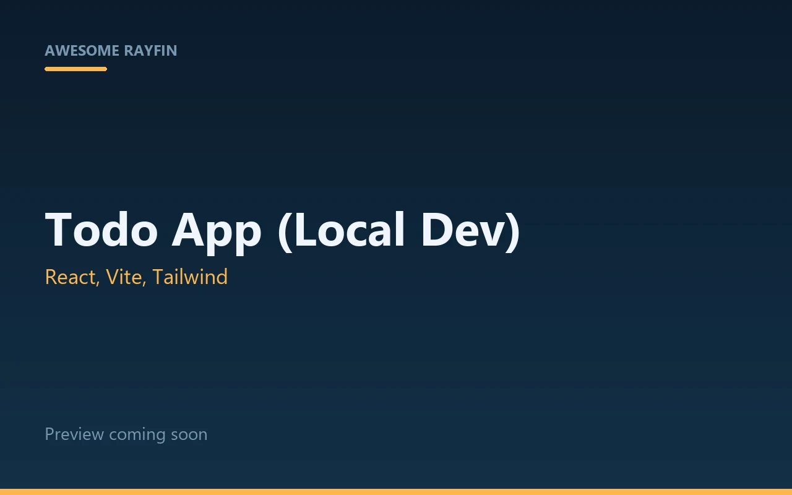
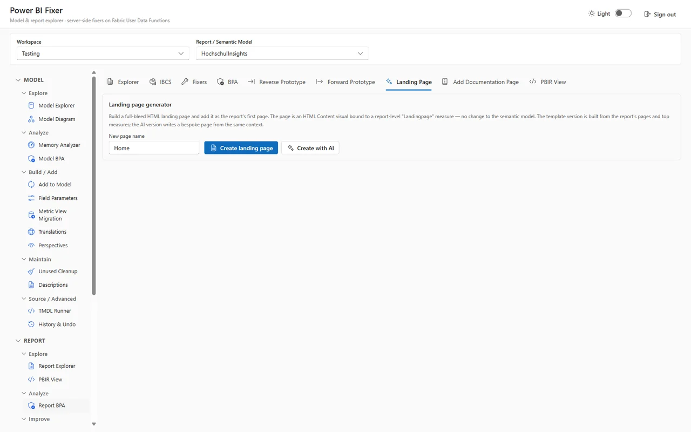
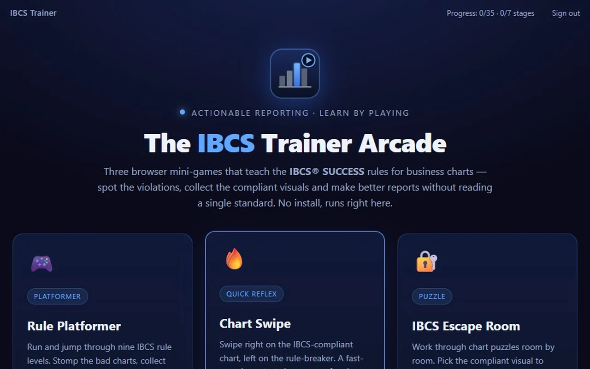

<!-- markdownlint-disable MD033 MD041 -->

<div align="center">

  <h1>🐟 Awesome Rayfin</h1>
  <p>A curated gallery of templates and community resources for Project Rayfin — the Backend-as-a-Service platform built for the agentic era.</p>

  <a href="#-templates">Templates</a> •
  <a href="#-resources">Resources</a> •
  <a href="CONTRIBUTING.md">Contribute</a>
</div>

---

```bash
npm create @microsoft/rayfin -- --template https://github.com/microsoft/awesome-rayfin
```

## What is Rayfin?

Project Rayfin is a modern **Backend-as-a-Service (BaaS)** platform that helps teams build and ship applications faster. Define your data model with TypeScript decorators, and Rayfin handles the backend — auth, data API, storage, and hosting.

```bash
npm create @microsoft/rayfin@latest    # scaffold from an official template
npx rayfin up                          # deploy and run
```

## Using This Gallery

Point the Rayfin CLI at this repo to scaffold any template from the gallery:

```bash
npm create @microsoft/rayfin -- --template https://github.com/microsoft/awesome-rayfin
```

```bash
# OR from a local clone
npm create @microsoft/rayfin -- --template ./awesome-rayfin
```

The CLI reads `rayfin-template.yml` at the repo root and presents an interactive picker when multiple templates are available.

---

## 📦 Templates

Browse by category — every row links to the template directory.

<!-- TEMPLATES:START -->

[🚀 Starter Templates](#-starter-templates) (3) · [🏢 Business Apps](#-business-apps) (3) · [📊 Analytical Apps](#-analytical-apps) (0) · [🧰 Fabric and Power BI Tools](#-fabric-and-power-bi-tools) (1) · [🌍 Digital Twins and Geospatial](#-digital-twins-and-geospatial) (0) · [🎮 Games and Interactive Learning](#-games-and-interactive-learning) (1)

### 🚀 Starter Templates

Minimal scaffolds to build on — auth wired up, nothing else in the way.

<table>
<thead>
<tr><th width="240">Preview</th><th>Template</th><th>Description</th><th align="center">Auth</th><th align="center">Data</th><th>Stack</th></tr>
</thead>
<tbody>
<tr>
<td width="240"><a href="./templates/angular-blankapp"></a></td>
<td><b><a href="./templates/angular-blankapp">Angular Blank App</a></b></td>
<td>Bare-bones Fabric-authenticated Angular + Material app — sign-in, routing, and a placeholder home page, with no data layer to remove</td>
<td align="center">✅</td>
<td align="center">✅</td>
<td>Angular, Material</td>
</tr>
<tr>
<td width="240"><a href="./templates/angular-dashboard"></a></td>
<td><b><a href="./templates/angular-dashboard">Angular Dashboard App</a></b></td>
<td>Responsive Angular Material dashboard — top navbar + collapsible side menu, Project/Task data model, and optional one-click GitHub Issues/PRs sync for a public repo.</td>
<td align="center">✅</td>
<td align="center">✅</td>
<td>Angular, Material</td>
</tr>
<tr>
<td width="240"><a href="./templates/static-blankapp"></a></td>
<td><b><a href="./templates/static-blankapp">Blank App</a></b></td>
<td>Bare-bones Rayfin app with authentication, but without any JS or CSS framework and a tiny TypeScript entry point</td>
<td align="center">✅</td>
<td align="center">✅</td>
<td>TypeScript, Vite</td>
</tr>
</tbody>
</table>

### 🏢 Business Apps

Everyday operational apps: dashboards, field work, and presenting.

<table>
<thead>
<tr><th width="240">Preview</th><th>Template</th><th>Description</th><th align="center">Auth</th><th align="center">Data</th><th>Stack</th></tr>
</thead>
<tbody>
<tr>
<td width="240"><a href="./templates/field-technician"></a></td>
<td><b><a href="./templates/field-technician">Field Technician App</a></b></td>
<td>Field service management app with role-based dashboards for dispatchers and technicians, job tracking, customer lookup, and dual-mode auth (local password + Fabric)</td>
<td align="center">✅</td>
<td align="center">✅</td>
<td>React, Vite, Tailwind</td>
</tr>
<tr>
<td width="240"><a href="./templates/slide-deck"></a></td>
<td><b><a href="./templates/slide-deck">Slide Deck</a></b></td>
<td>Interactive slide deck presenter with sessions, live slide tracking, and audience chat</td>
<td align="center">✅</td>
<td align="center">✅</td>
<td>React, Vite, Tailwind</td>
</tr>
<tr>
<td width="240"><a href="./templates/todo-local-experimental"></a></td>
<td><b><a href="./templates/todo-local-experimental">[Experimental] Todo app with full local dev</a></b></td>
<td>End-to-end todo CRUD with username/password auth, a Rayfin data model, and Docker local development — a working starter that exercises the full data path without Fabric</td>
<td align="center">✅</td>
<td align="center">✅</td>
<td>React, Vite, Tailwind</td>
</tr>
</tbody>
</table>

### 📊 Analytical Apps

Apps that put data and insight in front of an end user.

_No templates here yet._ Building one? Set `"category": "analytics"` in your template's `package.json` — see the [Contributing Guide](CONTRIBUTING.md).

### 🧰 Fabric and Power BI Tools

Apps that inspect, document, or administer the data platform itself.

<table>
<thead>
<tr><th width="240">Preview</th><th>Template</th><th>Description</th><th align="center">Auth</th><th align="center">Data</th><th>Stack</th></tr>
</thead>
<tbody>
<tr>
<td width="240"><a href="./templates/pbi-fixer"></a></td>
<td><b><a href="./templates/pbi-fixer">Power BI Fixer</a></b></td>
<td>Inspect, document, and fix Power BI semantic models and reports — best-practice analysis, one-click and batch fixes, a report explorer with PBIR diffs, and a free IBCS visual, powered server-side by Fabric User Data Functions</td>
<td align="center">✅</td>
<td align="center">—</td>
<td>React, Vite, Tailwind</td>
</tr>
</tbody>
</table>

### 🌍 Digital Twins and Geospatial

3D, map, and live-operations views of real-world systems.

_No templates here yet._ Building one? Set `"category": "digital-twins"` in your template's `package.json` — see the [Contributing Guide](CONTRIBUTING.md).

### 🎮 Games and Interactive Learning

Canvas and game-engine apps — proof there is no UI ceiling.

<table>
<thead>
<tr><th width="240">Preview</th><th>Template</th><th>Description</th><th align="center">Auth</th><th align="center">Data</th><th>Stack</th></tr>
</thead>
<tbody>
<tr>
<td width="240"><a href="./templates/ibcs-trainer"></a></td>
<td><b><a href="./templates/ibcs-trainer">IBCS Trainer</a></b></td>
<td>HTML5 Canvas platformer that teaches IBCS chart rules level by level, embedded in a Fabric-authenticated Rayfin app; each play-through is persisted to a typed GameStats entity</td>
<td align="center">✅</td>
<td align="center">✅</td>
<td>React, Vite, Tailwind</td>
</tr>
</tbody>
</table>

<!-- TEMPLATES:END -->

> **Adding a template?** See the [Contributing Guide](CONTRIBUTING.md). Pick a `template.category` and drop a preview image at `docs/previews/<template>.webp`, then run `node scripts/generate-manifest.mjs`.

---

## 📚 Resources

### Packages

| Package | Description |
|---------|-------------|
| `@microsoft/rayfin-core` | Entity decorators, schema definitions, and core types |
| `@microsoft/rayfin-client` | Typed data client for querying and mutating entities |
| `@microsoft/rayfin-cli` | CLI for scaffolding, deploying, and managing Rayfin apps |
| `@microsoft/create-rayfin` | `npm create` initializer for scaffolding new projects |

### Key Concepts

- **Data Modeling** — Define entities with `@entity()`, `@text()`, `@boolean()`, `@date()`, and other decorators from `@microsoft/rayfin-core`
- **Authentication** — Fabric Entra SSO in production, mock email/password locally
- **Typed Data Access** — Schema-driven GraphQL client with compile-time type checking
- **Static Hosting** — Deploy frontends with `rayfin up staticapp deploy`

---

## 🌊 Community

We welcome community-contributed templates! See the [Contributing Guide](CONTRIBUTING.md) for how to submit your own template to this gallery.

---

## Trademarks

This project may contain trademarks or logos for projects, products, or services.
Authorized use of Microsoft trademarks or logos must follow the [Microsoft Trademark and Brand Guidelines](https://www.microsoft.com/legal/intellectualproperty/trademarks/usage/general).
Use of Microsoft trademarks or logos in modified versions of this project must not cause confusion or imply Microsoft sponsorship.
Any use of third-party trademarks or logos is subject to those third parties' policies.

## License

[MIT](LICENSE)
