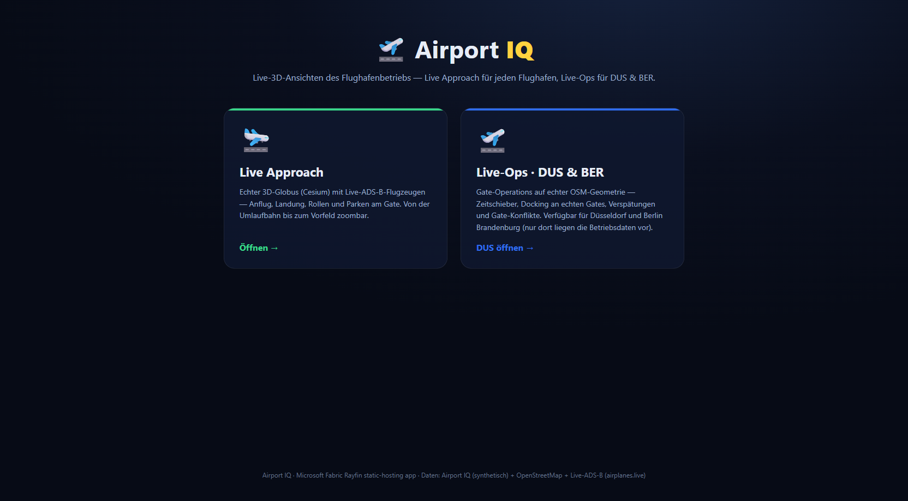
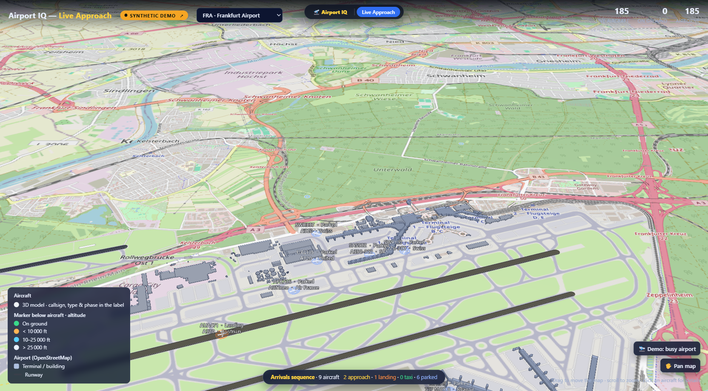
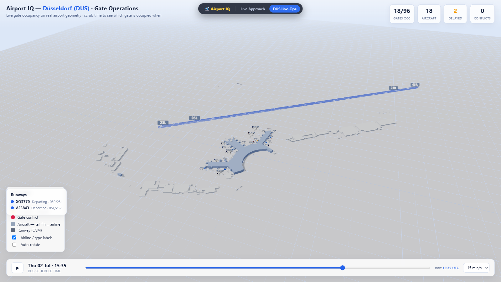

# Airport IQ — Rayfin app

A **Fabric static-hosting** [Project Rayfin](https://github.com/microsoft/awesome-rayfin) app that
tells an **airport-operations** story — from the perspective of a **single airport operator** —
through two interactive 3D views. It ships **fully synthetic, self-contained data** — everything
needed to run is in this template — and a single **data adapter** lets you swap the baked data for a
**live feed** or your **own Fabric warehouse**.

Nothing external is required to run it: no data pipeline, no lakehouse, no semantic model. Just
the app + baked JSON. See [Data sources & the adapter](#data-sources--the-adapter) to plug in live
or customer data.

> _With thanks to **Matthias Sobiech** for review and inspiration._

## Demo

**▶ [Watch the voice-over walkthrough](media/airport-iq-demo-voiceover.mp4)** (synthetic-data build).

| Landing page | Live Approach (synthetic) | Live-Ops (gate operations) |
| --- | --- | --- |
|  |  |  |

## The story — one airport's operations

Airport IQ is told from the point of view of **one airport operator**, not an airline. Instead of a
fleet spread across the globe, it centers on a **single airport** — its terminal, gates, runways and
the traffic flowing through it — the way an airport's operations team actually sees their day. The
template ships focused on **Düsseldorf (DUS)** and **Berlin Brandenburg (BER)**, and the same app
already flies the live-approach view for **FRA · MUC · BER · DUS · AMS**; point it at any airport by
adding that airport's geometry and (optionally) its data.

This app is the **visualization layer** of a larger Airport IQ solution (a Microsoft Fabric ontology,
data agent, real-time pipeline and Power BI reporting). The template deliberately carves out just the
**Fabric App** — the 3D operational picture — so it runs fully self-contained on synthetic data, with
one switch to bring in live or warehouse data.

**Why it helps an airport.** The Live-Ops view turns a flat schedule into a live operational picture:
*which gate is occupied when*, *which flights are running late*, and — the headline scenario — where
**gate conflicts cascade** (a delayed inbound double-books a stand, forcing a downstream
reallocation). The Live Approach view adds the outside picture: aircraft on final approach, landing,
taxiing and parking, in real 3D. Together they are the kind of shared **situational-awareness and
what-if** surface an airport operations center needs — running on the airport's *own* data when you
plug it in.

## The two views

| | **① Live Approach** | **② Live-Ops** |
| --- | --- | --- |
| Engine | CesiumJS 1.121 (3D globe) | Three.js r160 + OrbitControls |
| Shows | Aircraft on approach → landing → taxi → park, zoomable from orbit to the apron | Gate operations — time-scrubber, docking, delays, cascading gate conflicts |
| Airports | FRA · MUC · BER · DUS · AMS | DUS · BER |
| Data | Baked sample by default; opt-in live ADS-B | Fully synthetic snapshot |

All geometry (buildings, runways, gates) in both views comes from **OpenStreetMap**, filtered to the
aerodrome boundary, and is baked into the repo.

## Data sources & the adapter

Every view loads its data through a single seam — [`data-adapter.js`](data-adapter.js) — so the
*source* is a config switch, not a code fork. The mode is resolved from the `?data=` URL parameter
(→ `window.AIQ_DATA_MODE` → default `synthetic`):

| Mode | Aircraft / operations source | Notes |
| --- | --- | --- |
| `synthetic` *(default)* | Baked JSON in `views/*/data/**` | No network; ships in the template |
| `live` | [airplanes.live](https://airplanes.live) ADS-B API (poll 15 s) | Live Approach only; falls back to the baked `live.json` |
| `fabric` | **Your own Fabric warehouse / lakehouse** | The operations snapshot comes from *your* data, in the same shape |

Try it: append `?data=live` to the Live Approach URL for the live ADS-B feed. Out of the box, with
no parameter, everything is synthetic and offline.

> **Live ADS-B is opt-in and third-party.** The `live` mode calls the community
> [airplanes.live](https://airplanes.live) API, which is **non-commercial use only, has no SLA /
> uptime guarantee, and is rate-limited to 1 request/second** (this app polls every 15 s). It is
> **off by default** — the template ships and runs entirely on synthetic data. If you enable
> `?data=live` you are responsible for complying with the
> [airplanes.live terms of use](https://airplanes.live/terms-of-use/). Buildings, runways, gates and
> basemap are **© OpenStreetMap contributors** ([ODbL](https://www.openstreetmap.org/copyright)).

### Bring your own data (Fabric warehouse / lakehouse)

The Live-Ops view is driven by an **operations snapshot** — gates, flights, gate assignments, delays
and conflicts (see the contract in [`rayfin/data/schema.ts`](rayfin/data/schema.ts)). To replace the
baked snapshot with an airport's **own live data**:

1. Produce the snapshot shape from your Fabric **warehouse** or **lakehouse SQL endpoint** — either
   by enabling the Rayfin `data` service (`rayfin.yml` → `data.enabled: true`, `dialect: mssql`) or a
   **User Data Function** that queries your tables and returns the JSON shape in `schema.ts`.
2. Point the adapter at it: set `window.AIQ_FABRIC_SNAPSHOT_URL` to your endpoint and load the view
   with `?data=fabric`. If the endpoint is unset or unreachable, the adapter transparently falls back
   to the baked snapshot, so the demo never breaks.

Geometry (buildings, runways, gates) always stays OpenStreetMap — only the *operational* data is
swapped. This is the "same demo, your airport's real numbers" path.

## Getting started

```powershell
# 1. Preview locally (no build needed — static files)
npm run serve                     # serves this folder on http://localhost:8096

# 2. Assemble the hosting bundle
npm run build:fabric              # writes fabric-dist/ (index.html + views/**)

# 3. Deploy to Fabric static hosting
npm run rayfin:up
```

Open <http://localhost:8096/> for the landing page, or a view directly:
`views/approach/index.html?ap=FRA` · `views/liveops/index.html?ap=DUS`.

## Project structure

| Path | Purpose |
| --- | --- |
| `index.html` | Landing page with two tiles opening the views |
| `views/approach/` | Live Approach view (CesiumJS) + `data/` (geojson geometry, `live.json`, `airports.json`) + `models/` (glTF aircraft) |
| `views/liveops/` | Live-Ops view (Three.js) + `data/<AP>/` (`snapshot.json`, `buildings.json`, `runways.json`) |
| `tools/build-fabric.mjs` | Assembles `fabric-dist/` for Rayfin static hosting |
| `tools/build_planes.py` | Regenerates the glTF aircraft models |
| `rayfin/rayfin.yml` | Rayfin service config (Fabric auth + static hosting) |

## Scripts

| Script | What it does |
| --- | --- |
| `npm run serve` | Serve the app locally on `http://localhost:8096` |
| `npm run build` / `npm run build:fabric` | Assemble `fabric-dist/` (the deployable bundle) |
| `npm run lint` | Syntax-check the JavaScript (`node --check`) |
| `npm test` | Smoke test — build the bundle and assert its key files exist |
| `npm run rayfin:up` | Deploy to Fabric static hosting via the Rayfin CLI |

## Design notes

This is intentionally a **no-framework, static-hosting template** — plain HTML + JavaScript with
**CesiumJS** and **Three.js** loaded from a CDN, not the React/Vite/Tailwind baseline the other
gallery templates use. The two views are self-contained 3D apps, so a bundler/framework would add
weight without benefit; `build` just copies the files into `fabric-dist/`.

For the same reason the checks are deliberately lightweight rather than ESLint/Vitest: `lint` runs
`node --check` (JavaScript syntax validation) and `test` is a smoke test that builds the bundle and
asserts the key files are present. This keeps the template dependency-free while still satisfying the
gallery's `lint` / `build` / `test` CI steps.

## Roadmap

Airport IQ is an evolving demo. Beyond aircraft and gates, we plan to extend the operational picture
with more of an airport's real-world flows — ideas on the roadmap include:

- **Baggage & conveyor-belt flow** — follow bags from check-in through the sortation system to the
  aircraft, and surface mis-routes and bottlenecks.
- **Passenger flow** — movement through the terminal (check-in → security → gates), dwell times and
  congestion hotspots.
- **More airports** with full operational snapshots, and deeper **live-data** integration.

The goal is a single, tailorable operational picture an airport can point at its own data.
Ideas and contributions are welcome.

## License

[MIT](LICENSE)
