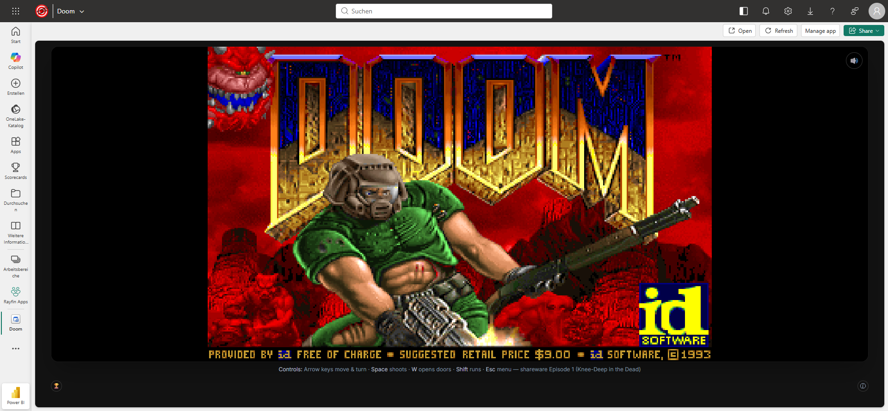
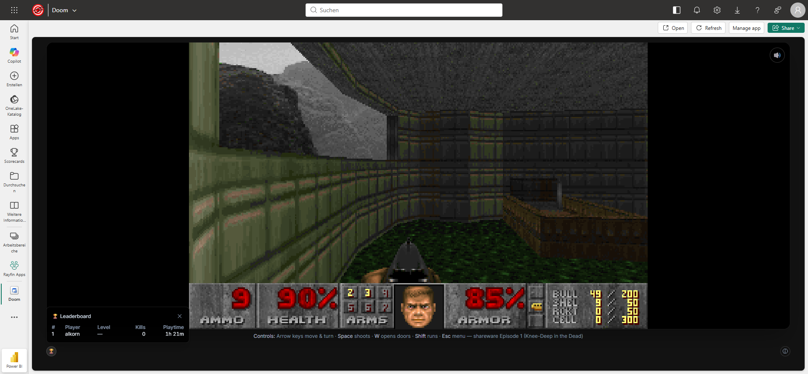

# Doom (Rayfin) — "But can it run Doom?" on Microsoft Fabric

Shareware **DOOM** (Episode 1, *Knee-Deep in the Dead*) booted in the browser through
[js-dos](https://js-dos.com/) / DOSBox and wrapped in a **Fabric-authenticated Rayfin app** —
extended with a real **Rayfin data layer**: per-level stats read straight off DOOM's own
"FINISHED" screen, a shared **leaderboard**, and **save games that survive reloads**.

> **But can it run Doom?** — the traditional proof that a platform has matured. With Fabric
> Apps you can run pro-code in Fabric, so… yes, it can. 🔫



## Install this template

```bash
npm create @microsoft/rayfin@latest -- --template https://github.com/microsoft/awesome-rayfin --template-name "Doom"
```

## Credits

The **original concept and Fabric/Rayfin integration are Sander van de Velde's** — this template
is built on his work. Go star and follow it:

- **Sander van de Velde** — the original "Doom as a Microsoft Fabric App" idea & integration
  - Repo: [sandervandevelde/Play-Doom-On-Microsoft-Fabric](https://github.com/sandervandevelde/Play-Doom-On-Microsoft-Fabric)
  - LinkedIn: [Playing Doom as a Microsoft Fabric App](https://www.linkedin.com/posts/sandervandevelde_mvpbuzz-share-7476168860279341056-2Xrv/)
  - Blog: [Playing games as a Microsoft Fabric App via Rayfin](https://sandervandevelde.wordpress.com/2026/06/07/playing-zork-i-as-a-microsoft-fabric-app-via-rayfin/)
- **[thedoggybrad/doom_on_js-dos](https://github.com/thedoggybrad/doom_on_js-dos)** — DOOM-in-the-browser via js-dos / DOSBox
- **id Software** — the DOOM engine (GPL) and the freely-redistributable **shareware** game data

This template **extends** Sander's app with a Rayfin **data layer** (session tracking, per-level
stats, a leaderboard, and cloud-persisted save games) and repackages it as a **100% self-hosted,
100% shareware** bundle — no external network calls, no commercial assets.

## What this adds over the original

Sander's original is a faithful merge of the Rayfin **Blank App** template and thedoggybrad's
DOOM: it **boots and plays** DOOM inside a Fabric app (runtime + WAD hot-linked from an external
site), with **no data layer**. This template keeps that idea and adds two things.

### 1 · Self-contained, 100% shareware

| | Original | This template |
|---|---|---|
| js-dos / DOSBox runtime | hot-linked from an external site | **self-hosted** in `public/jsdos/` (GPL) |
| Game data (IWAD) | external WAD | id **shareware** `DOOM1.WAD` — free to redistribute |
| Runtime network calls | yes | **none** — fully self-contained |
| 4-episode menu graphic (`M_EPI4`) | n/a | **synthesised from the shareware WAD's own `M_EPI3`** — no third-party art |

> **No Freedoom needed.** The id **shareware** episode is vanilla-DOSBox-compatible, small, and
> licensed for free redistribution — it is good enough on its own. (Freedoom's IWAD is ~28 MB,
> targets limit-removing source ports, and OOMs em-dosbox, so it is intentionally not used.)

### 2 · A Rayfin data layer (the new engineering)

| Feature | What it does | Entity |
|---|---|---|
| **Session tracking** | Records who played, when, and for how long (heartbeat + flush) | `DoomSession` |
| **Per-level stats** | Reads **kills % · items % · secrets % · time · level** straight off DOOM's "FINISHED" intermission screen; one row per completed level | `DoomLevelResult` |
| **Leaderboard** | Shared board ranked by **farthest level reached → total kills**, with playtime alongside | *(aggregates the two above)* |
| **Cloud save games** | Mirrors DOOM's `DOOMSAV*.DSG` files to the backend and restores them into the emulator on the next boot — so **Save/Load survives reloads** and follows you across devices | `DoomSave` |

Plus playability/UX polish: **auto-launch**, a **mute** button (Web-Audio master gain), an
**aspect-ratio-correct, full-height** layout, and browser-friendly **controls** (Space shoots,
Shift runs, W opens/uses — Ctrl is swallowed by the browser).



### How the stats reader works (DOSBox is a black box)

DOSBox exposes nothing about DOOM's internal state to JavaScript, so per-level stats are **read
off the screen**. When a level ends, DOOM shows its "FINISHED" tally; the app grabs the game
canvas (`getImageData` — js-dos renders to a 2D canvas at an exact 2× of 320×200) and
**template-matches DOOM's own number font**, extracted from the shareware WAD by
[`scripts/extract-glyphs.py`](scripts/extract-glyphs.py), at the fixed screen positions from
DOOM's `WI_stuff.c`. That yields kills/items/secrets/time plus the level banner — deterministic
and palette-exact, no memory hacking. [`scripts/test-reader.ts`](scripts/test-reader.ts)
self-tests the decoder offline.

Cloud saves work the same "reach into the emulator" way: js-dos runs on an in-memory filesystem,
so [`public/jsdos/js-dos-api.js`](public/jsdos/js-dos-api.js) is patched to expose the Emscripten
`FS`, and [`src/game/doomSaves.ts`](src/game/doomSaves.ts) reads/writes the `.DSG` files there.

## Getting started

```bash
npm install
npm run dev
```

Open <http://localhost:5173>, sign in (mock email/password locally), and DOOM boots in the page
(it auto-starts). Play, and your session, completed levels, and saves are recorded through the
Rayfin data client.

> Self-contained — depends only on the published `@microsoft/rayfin-*` packages from the public
> npm registry.

## Deploy to Fabric

```bash
npm run rayfin:up            # deploy into "My Workspace"
# or target a specific workspace:
npx rayfin up --tenant <tenantId> --workspace-id <workspaceId> -y
```

`rayfin up` builds (`npm run build:fabric`), packages `dist/` (the app + self-hosted `jsdos/`
runtime + `game/doom.zip`), provisions the SQL data entities, and publishes an `AppBackend` item
with a Fabric-hosted URL and brokered auth.

## The data model

All entities are scoped to the signed-in player via `user_id` (JWT `sub` claim).

- **`DoomSession`** — one row per play session (player, start/end, duration; heartbeated).
- **`DoomLevelResult`** — one row per completed level (episode, map, kills/items/secrets %, time).
- **`DoomSave`** — one row per save slot: the raw `.DSG` bytes (base64) + emulator FS path.

`DoomSession` and `DoomLevelResult` are readable by everyone (shared leaderboard); `DoomSave` is
private to its owner. All rows can only be written by the player who owns them.

## Project structure

```text
├── public/
│   ├── jsdos/
│   │   ├── js-dos-api.js   # js-dos v6 loader — patched to expose the Emscripten FS
│   │   ├── js-dos-v3.js    # DOSBox WASM/asm.js runtime (GPL, self-hosted)
│   │   └── jquery.min.js   # loaded before js-dos (its bundled jqlite fails in the Fabric runtime)
│   └── game/doom.zip       # DOS bundle: shareware DOOM.EXE + DOOM1.WAD (+ setup files)
├── rayfin/
│   ├── rayfin.yml          # Fabric service config (auth + data + static hosting)
│   └── data/
│       ├── DoomSession.ts      # play-session records
│       ├── DoomLevelResult.ts  # per-level stats
│       ├── DoomSave.ts         # persisted save games
│       └── schema.ts           # registers the entities
├── scripts/
│   ├── extract-glyphs.py   # extracts the DOOM number font from the WAD -> src/game/doomGlyphs.ts
│   └── test-reader.ts      # offline self-test for the intermission reader
├── src/
│   ├── main.tsx            # Entry point + Rayfin client bootstrap
│   ├── App.tsx             # Routes and auth gate
│   ├── pages/HomePage.tsx  # Boots DOOM; wires session, stats, leaderboard, saves, mute
│   ├── game/
│   │   ├── doomStats.ts    # reads the FINISHED screen (template matching)
│   │   ├── doomSaves.ts    # mirrors save files to/from the emulator FS
│   │   └── doomGlyphs.ts   # generated font/glyph templates (from the WAD)
│   ├── hooks/AuthContext.tsx
│   ├── components/AuthPage.tsx
│   └── services/           # Auth + typed Rayfin client wiring
└── package.json
```

## Scripts

| Command | Description |
|---------|-------------|
| `npm run dev` | Deploy app to Fabric and start local dev server |
| `npm run build` | Production build |
| `npm run build:fabric` | Build for Fabric deployment |
| `npm run lint` | Lint with ESLint |
| `npm run test` | Run unit tests with Vitest |
| `npm run rayfin:up` | Deploy app to Fabric (no local dev server) |

## Licensing & IP

Safe to publish, provided the credits above stay intact and the shipped WAD stays the
**shareware** one.

- **Engine / runtime** — the DOOM engine source is GPL (id Software, 1997/1999); js-dos / DOSBox
  are GPL / LGPL. Self-hosting the runtime is fine.
- **Game data** — the **shareware** `DOOM1.WAD` + shareware `DOOM.EXE` are **licensed by id for
  free redistribution** (the whole point of shareware), so shipping them here is allowed ✅. The
  commercial / retail WADs are **not** included and must never be committed ❌.
- **`M_EPI4`** — the 4-episode menu graphic the Ultimate engine expects is **synthesised from the
  shareware WAD's own `M_EPI3`**; no third-party or commercial art is bundled. (Side effect: the
  episode menu lists "Inferno" twice — harmless, only Episode 1 is playable in shareware anyway.)
- **Trademark** — "DOOM" is a registered trademark of id Software / ZeniMax / Microsoft, used
  here only descriptively; no endorsement or affiliation is implied.

> **AI-assist disclosure:** GitHub Copilot assisted with the Rayfin data layer (screen-reading
> stats decoder, leaderboard, save persistence), the 100%-shareware repackaging, and the Fabric
> deployment. All behavior was tested in a real browser and on the deployed Fabric app.
