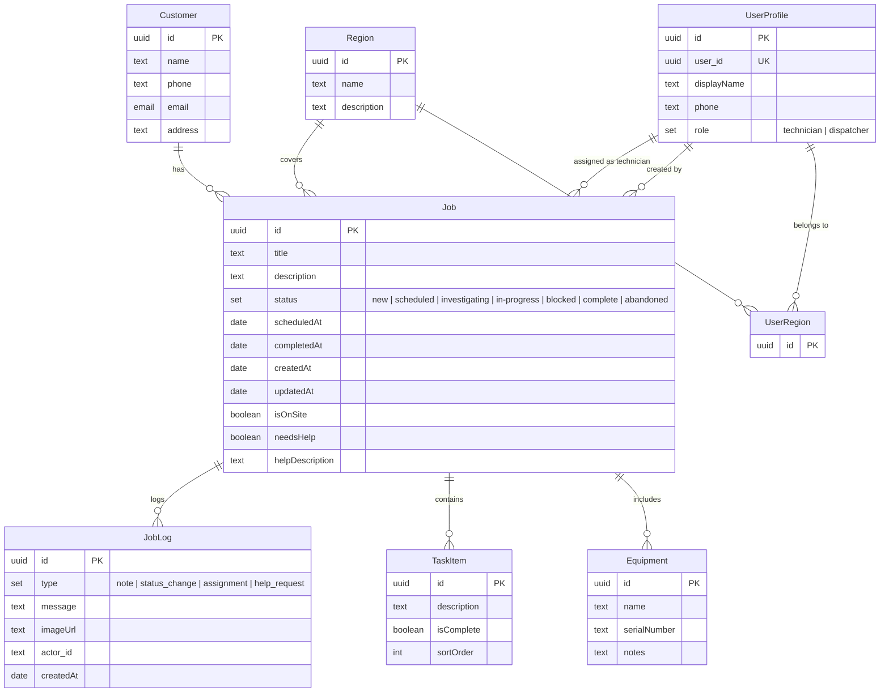

# Field Technician App

A field service management application built with Rayfin. Features role-based dashboards for dispatchers and technicians, job tracking, customer lookup, equipment management, and dual-mode authentication (local password + Fabric).

## Getting started

### Create a new project

```bash
npm create @microsoft/rayfin@latest -- --template field-technician
```

This scaffolds a new project and installs dependencies automatically.

### Prerequisites

- [Node.js](https://nodejs.org/) 20+
- [Docker Desktop](https://www.docker.com/products/docker-desktop/) (for local development)
- [GitHub CLI](https://cli.github.com/) authenticated with `read:packages` scope (for pulling container images)

### Local development (Docker)

Runs the full Rayfin backend locally in Docker — no Fabric workspace needed:

```bash
npm run dev:local
```

### Cloud development (Fabric)

Deploys to a Fabric workspace and starts the local Vite dev server:

```bash
npm run dev
```

The first run provisions services in your Fabric workspace. Subsequent runs reuse the existing deployment.

## Project structure

```
├── rayfin/
│   ├── rayfin.yml          # Rayfin service configuration
│   ├── tsconfig.json       # TypeScript config for Rayfin data models
│   └── data/
│       ├── schema.ts       # Schema type and entity exports
│       ├── Customer.ts     # Customer entity
│       ├── Equipment.ts    # Equipment entity
│       ├── Job.ts          # Job entity with status tracking
│       ├── JobLog.ts       # Job activity log entries
│       ├── Region.ts       # Service regions
│       ├── TaskItem.ts     # Per-job task checklist items
│       ├── UserProfile.ts  # User profiles with role assignment
│       └── UserRegion.ts   # User–region assignments
├── src/
│   ├── main.tsx            # React entry point with auth bootstrap
│   ├── App.tsx             # Router with role-based redirects
│   ├── components/         # Auth forms and shared UI components
│   ├── hooks/              # Auth context and data hooks
│   ├── pages/              # Route page components
│   ├── services/           # Service container and Rayfin integrations
│   └── lib/                # Utility functions
├── scripts/
│   └── check-docker-ghcr.mjs  # Docker/GHCR pre-flight checks
└── package.json
```

## Scripts

| Script | Description |
| --- | --- |
| `npm run dev` | Deploy to Fabric and start Vite dev server |
| `npm run dev:local` | Start Docker backend and Vite dev server |
| `npm run dev:local:stop` | Stop local Docker containers (keeps data) |
| `npm run dev:local:down` | Remove local Docker containers (keeps volumes) |
| `npm run dev:local:purge` | Purge containers and volumes (full reset) |
| `npm run up` | Deploy to Fabric without a dev server |
| `npm run build` | Type-check and build for production |
| `npm run lint` | Run ESLint |
| `npm run test` | Run tests with Vitest |
| `npm run rayfin:dev` | Invoke `rayfin dev` with the Docker feature flag |
| `npm run rayfin:db` | Apply database migrations locally |

## Authentication

The app supports two authentication modes, selected automatically based on the API URL:

- **Local (password)** — When the API URL points to `localhost`, username/password sign-in and sign-up are available. Used with `npm run dev:local`.
- **Fabric** — When deployed to a Fabric workspace, brokered Fabric authentication is used. Used with `npm run dev`.

Both modes are supported simultaneously when the appropriate environment variables are present.

## Data model

The app manages field service operations with these entities:

- **Customer** — Customer records with contact information
- **Equipment** — Equipment tracked per job
- **Job** — Service jobs with status, scheduling, and assignment
- **JobLog** — Activity log entries for each job
- **Region** — Geographic service regions
- **TaskItem** — Checklist tasks within a job
- **UserProfile** — User profiles with dispatcher/technician roles
- **UserRegion** — Maps users to their assigned regions


