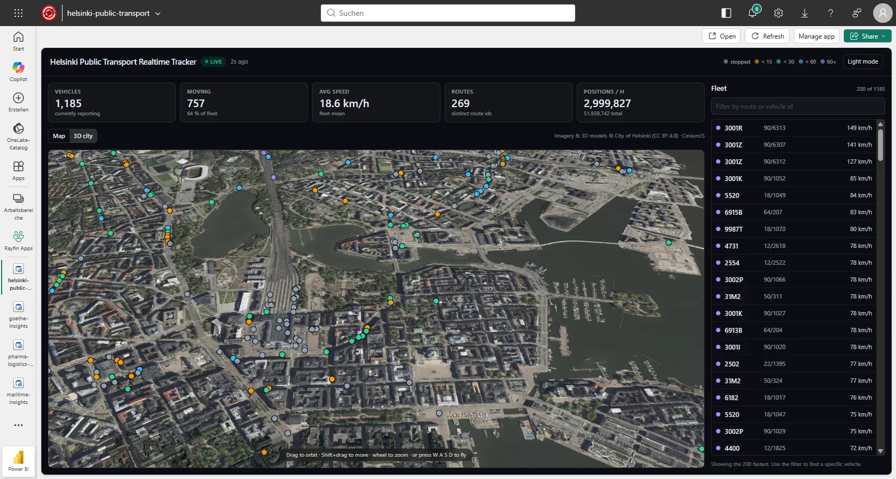
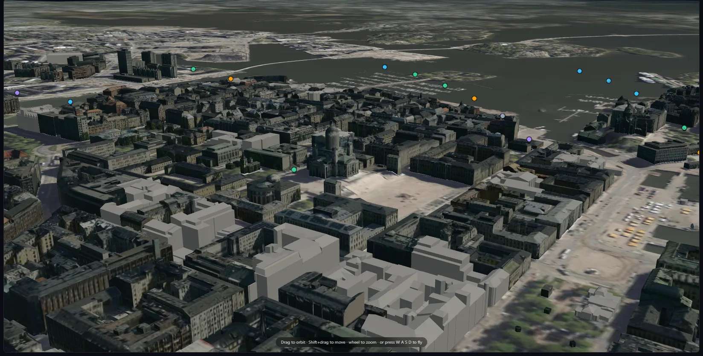
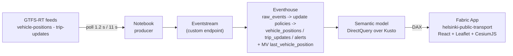

# Helsinki Public Transport

Live map of a city's public transport, built as a **Microsoft Fabric App** (Rayfin) on top of a
**Real-Time Intelligence** stack in Microsoft Fabric.

> **Author: Kevin Thomas** - the original Helsinki real-time transit solution, its Real-Time
> Intelligence architecture, the Fabric portal host-bridge data path and the app's feature set
> are his.
>
> Packaged as a template by **Alexander Korn**, who added a token-free 3D city twin and some minor
> changes.

Vehicle positions come from the public [HSL GTFS-RT feeds](https://hsldevcom.github.io/gtfs_rt/)
(Helsingin seudun liikenne, the Helsinki region transport authority). No API key is required.

## Screenshots

Live in the Fabric portal - 1,179 vehicles, no second sign-in, DAX served over the host bridge:


`3D city` - the same live fleet on the City of Helsinki's textured LoD2 buildings, no Cesium ion
token and no Google Maps key:



Down at street level the vehicles stay on top of the buildings, because they are clamped to the
same terrain the buildings sit on:



## Architecture



The app never talks to Kusto directly - it only ever issues DAX against the semantic model, and the
semantic model's Kusto datasource is configured for end-user SSO, so every user reads the
Eventhouse under their own identity.

### How the browser reaches the semantic model

`src/services/daxGateway.ts` picks a transport at runtime and falls through in this order:

| # | Transport | When it applies |
| --- | --- | --- |
| 1 | **Fabric host bridge** (`src/services/fabricHostBridge.ts`) | The app is embedded in the Fabric portal. The portal exposes a `postMessage` channel (`fabric-app-data-semantic-model`, method `semanticModel.executeDaxJson`) and runs the DAX server-side as the signed-in portal user. **No second sign-in, no token in the browser.** |
| 2 | **Rayfin connector** (`fabric-semanticmodel`) | Server-side execution through the Rayfin backend, using the ids in `rayfin/rayfin.yml`. Experimental SDK surface. |
| 3 | **Power BI REST** (`src/services/powerBiDirect.ts`) | The app is opened standalone, outside the portal. MSAL acquires a Power BI token - silent SSO first, interactive only if that fails - and calls `executeQueries`. |

The host bridge is tried first on purpose: inside the portal it is both the fastest path and the
only one that does not ask the user to sign in a second time.

## The 3D city view

The `3D city` mode renders vehicles on the City of Helsinki's own semantic city model - **with no
Cesium ion token and no Google Maps API key**. Every layer is CC BY 4.0 open data streamed straight
from `kartta.hel.fi`, which sends CORS headers, so nothing has to be re-hosted or baked:

| Layer | Source |
| --- | --- |
| Textured semantic LoD2 buildings | CityGML converted to 3D Tiles |
| Terrain | quantized-mesh (2021) |
| Base imagery | `Ortoilmakuva_2025_5cm` orthophoto WMS, 5 cm/px |

### One surface, not four

The city also publishes photogrammetric reality meshes for 2015, 2017 and 2024, and all three were
wired up here at one point - 2017 was offered in the UI as `Photoreal`. They are gone, for a reason
that outranks how good the photogrammetry looks: **vehicles are clamped to the terrain, not to the
mesh.** The mesh surface sits several metres above the terrain, so close in the vehicles sank under
the buildings and disappeared. A transit map that hides the transit when you zoom in is not a
feature with a trade-off; it is broken.

The cost argument points the same way. Measured from an identical view on a cold cache:

| Surface | Settles in | GPU memory | Frame rate while loading |
| --- | --- | --- | --- |
| Mesh 2017 | 7.9 s | 52 MB | 47.6 |
| Mesh 2024 | 10.6 s | **406 MB** | 35.9 |
| Mesh 2015 | 2.0 s | 53 MB | 48.8 |
| CityGML buildings | 2.5 s | 57 MB | 47.3 |

The tree tileset went with them. It was a second network round trip and a second set of tiles for
canopy that reads as green mush from any altitude the app is actually flown at.

Tuning was **not** the lever: with a cold cache and the same view, `maximumScreenSpaceError`
16 / 24 / 32 settled in 13.7 s / 12.1 s / 12.9 s, and `skipLevelOfDetail` made it worse. The time
goes on fetching tiles from `kartta.hel.fi`. Nor are the vehicles a cost - 1,420 ground-clamped
points render at the same 60 fps as 120.

### Why the buildings are tinted

Not every building in Helsinki's CityGML dataset carries facade textures. The untextured ones ship
a plain white material, and lit by the sun next to their dark-roofed textured neighbours they read
as glaring white boxes. The tileset therefore carries a `Cesium3DTileStyle` that multiplies
everything by a warm stone tint (`BUILDING_TINT`). Multiply is the right operator here: it barely
touches a textured facade, and it drops the blank ones into masonry. Any city model with the same
gap can be fixed the same way.

Cesium's default credit is the Cesium *ion* logo, which would be misleading here - `Ion.defaultAccessToken`
is blanked, the credit container is hidden, and attribution is rendered in the app chrome instead.

Attribution: *Source: 3D models of Helsinki, Helsingin kaupunginkanslia, CC BY 4.0.*

A Cesium ion / Google Photorealistic 3D Tiles variant is deliberately **not** wired up - it swaps a
free licence-clean source for a metered one, and it would reintroduce the clamping problem above.

## Operator comments

Everything above is a read of the Eventhouse. The comments section on the vehicle panel is the one
part that writes: a note pinned to a vehicle, stored in the app's own database through the Rayfin
data service.

That is the difference between a dashboard and a tool. The GTFS-RT feed can say a bus has not moved
in nine minutes; only a person can say the doors are jammed and maintenance is already on the way -
and that is exactly the context the next shift needs.

Access is deliberately asymmetric, declared on the entity in `rayfin/data/VehicleComment.ts`:

```ts
@role('authenticated', ['read', 'create'])
@role('authenticated', ['update', 'delete'], {
  policy: (claims, item) => claims.sub.eq(item.user_id),
})
```

Every signed-in user reads every note - a comment only its author can see is useless to a control
room - but editing and deleting are gated on the JWT `sub` claim matching `user_id`. That check runs
in the data layer, not in the UI: hiding the delete button is a courtesy, the policy is the control.

Comments are fetched when the selection changes and after a write, never polled. Positions change
every second and are polled accordingly; comments change when somebody types one.

Enabling `services.data` provisions a SQL database beside the app item. Apply the schema after the
first deploy:

```bash
npx rayfin up db apply
```

## Layout

| Path | What |
| --- | --- |
| `src/data/queries.ts` | the three DAX queries the app issues |
| `src/data/model.ts` | row decoding (`[alias]` vs `'Table'[alias]` keys) and domain types |
| `src/hooks/useDaxQuery.ts` | generic polling DAX hook (reschedules *after* each response) |
| `src/hooks/useFleet.ts` | vehicles, fleet stats, counters, selected-vehicle track |
| `src/services/daxGateway.ts` | transport selection - host bridge, connector, Power BI REST |
| `src/services/fabricHostBridge.ts` | `postMessage` DAX bridge used when embedded in the portal |
| `src/services/powerBiDirect.ts` | MSAL + `executeQueries` fallback for standalone use |
| `src/components/MapView.tsx` | Leaflet map; markers are moved, not rebuilt, each poll |
| `src/components/CesiumView.tsx` | token-free 3D scene over the Helsinki open geodata |
| `src/cesium/helsinkiOpenData.ts` | every Helsinki endpoint, in one place |
| `src/dev/CesiumPreview.tsx` | dev-only 3D harness (see below) |
| `scripts/copy-cesium.mjs` | copies Cesium's runtime assets into `public/cesium/` |
| `rayfin/rayfin.yml` | services + the `hslModel` connector declaration |
| `rayfin/connectors/schema.ts` | typed connector schema for the SDK |
| `fabric/` | definitions of the Fabric items backing the app |
| `fabric/deploy/` | scripted, idempotent provisioning of those items (see [Deploy](#deploy)) |
| `tools/verify_publishable.py` | audits the tree for tenant-specific values before you share it |

## Develop

```bash
npm install
npm run dev      # rayfin up (backend only) + vite
```

The 3D scene can be checked without going through Fabric sign-in:

```bash
npm run cesium:assets
node node_modules/vite/bin/vite.js . --port 5199
# then open http://localhost:5199/?preview=cesium
```

That harness renders `CesiumView` with synthetic vehicles. It is guarded by `import.meta.env.DEV`,
so it is compiled out of production builds.

## Deploy

The app is one of two halves. The **back end** (Eventhouse, Eventstream, producer notebook,
semantic model) has to exist first; the **front end** is then a single `rayfin up`.

### Back end

`fabric/deploy/` provisions everything from the definitions in `fabric/`. The scripts need nothing
but Python 3.10+ and the Azure CLI - no SDK, no secrets. Each one is idempotent: it looks for an
existing item by display name and updates rather than duplicating, so a failed run can simply be
repeated. Ids are recorded in `fabric/deploy/.state.json` and picked up by the following steps.

```powershell
az login --tenant <tenant-id>

$env:FABRIC_TENANT_ID    = "<tenant-id>"
$env:FABRIC_WORKSPACE_ID = "<workspace-id>"
$env:FABRIC_FOLDER_ID    = "<folder-id>"   # optional

cd fabric/deploy
python 01_eventhouse.py        # Eventhouse + KQL database, records the cluster URI
python 02_kql_schema.py        # tables, parse functions, update policies, the MV
python 03_eventstream.py       # custom endpoint -> Eventhouse, fresh node GUIDs
python 04_notebook.py          # producer notebook, eventstream ids patched in
python 05_semantic_model.py    # TMDL repointed at the new cluster and database
python 06_bind_credentials.py  # <- the step everything else depends on
python 07_schedule.py          # hourly trigger for the notebook
python 09_verify.py            # end-to-end check
```

Step 6 is the one that is easy to miss. Without it `executeQueries` returns HTTP 400
`DatasetExecuteQueriesError` and the app shows zeros with no useful message. It takes ownership of
the dataset, seeds the gateway datasource with a real Kusto token, then switches it to end-user
SSO so nothing stored can expire.

Step 8 is optional and only matters for the standalone sign-in path:

```powershell
$env:PBI_CLIENT_ID = "<spa-app-registration-id>"
$env:APP_ORIGINS   = "https://<app>.webapp.fabricapps.net,http://localhost:5173"
python 08_entra_redirects.py
```

Inside the Fabric portal the host bridge is used and no token is acquired in the browser at all,
so that step can be skipped entirely.

`09_verify.py` checks the eventstream topology, Kusto freshness and the app's own DAX, in that
order. If it reports a node that is not `Running`, re-run it with `--resume`: pausing the capacity
pauses the Eventhouse *destination*, and resuming the capacity does not resume it - the producer
keeps running and the events have nowhere to land.

`fabric/eventhouse/RealTimeDashboard.json` is not provisioned by any of these steps. It is a
Real-Time Dashboard the app does not depend on; import it by hand if you want it.

### Front end

```bash
npx rayfin up --workspace-id <workspace-id> --tenant <tenant-id> -y
```

Point the app at the model created above via `VITE_PBI_DATASET_ID` (see `.env.example`) and the
connector entry in `rayfin/rayfin.yml`.

### Deploying a second instance into another workspace

The same front end can run against an existing back end in a different workspace - or a different
tenant - without disturbing the first deployment. `rayfin/.deployments.json` keys each deployment
by workspace name, so both coexist.

```bash
npx rayfin up --workspace-id <other-workspace-id> --tenant <other-tenant-id> -y
```

Two things have to be pointed at the other workspace's semantic model before the build, because
they are baked into the bundle:

- `VITE_PBI_DATASET_ID` - put it in `.env.production.local`, which Vite loads *after* the
  generated `.env.local` and therefore wins. `VITE_FABRIC_WORKSPACE_ID` needs no attention: the
  CLI writes it before it builds.
- `connectors.hslModel.config` in `rayfin/rayfin.yml`.

Afterwards the CLI leaves `rayfin/.env`, `.env.local` and the active deployment pointing at the
new target. Restore them if the original workspace should stay the default.

## Scripts

| Command | What it does |
| --- | --- |
| `npm run dev` | `rayfin up` (backend only) + Vite dev server on 5173 |
| `npm run build` | TypeScript project build + Vite production build |
| `npm run build:fabric` | Same, but copies the Cesium runtime assets first - used by Fabric static hosting |
| `npm run cesium:assets` | Copies Cesium's `Assets/ThirdParty/Widgets/Workers` into `public/cesium/` |
| `npm run lint` | ESLint 9 flat config |
| `npm test` | Vitest unit tests |
| `npm run preview` | Serves the production build locally |

## Licence and attribution

MIT, see [LICENSE](LICENSE). The app renders open data it does not own - the HSL GTFS-RT feed and
the City of Helsinki 3D city model, both CC BY 4.0, both fetched live from the publisher. See
[NOTICE.md](NOTICE.md).

## Notes

- The producer notebook runs on an **hourly schedule** with a 58 min runtime budget, so runs hand
  over without overlapping. It also stands down if an older run is still active.
- The notebook holds **no secrets**: it resolves the Eventstream connection string at run time from
  `GET /v1/workspaces/{ws}/eventstreams/{id}/sources/{sourceId}/connection` using its own identity.
- The semantic model's Kusto datasource uses **end-user SSO**, so every app user queries the
  Eventhouse under their own identity and no stored token can expire.
- Requires Rayfin **1.34.0-beta.1** or newer - the semantic model connector runtime does not exist
  in 1.33.x.
- CesiumJS is code-split into its own chunk, so opening the default 2D map never downloads it.
- `public/cesium/` is generated by `scripts/copy-cesium.mjs` and git-ignored. `vite-plugin-cesium`
  sets `CESIUM_BASE_URL` but does not serve those files in dev, which makes Cesium parse Vite's
  SPA fallback HTML as JSON and die - hence the explicit copy.
