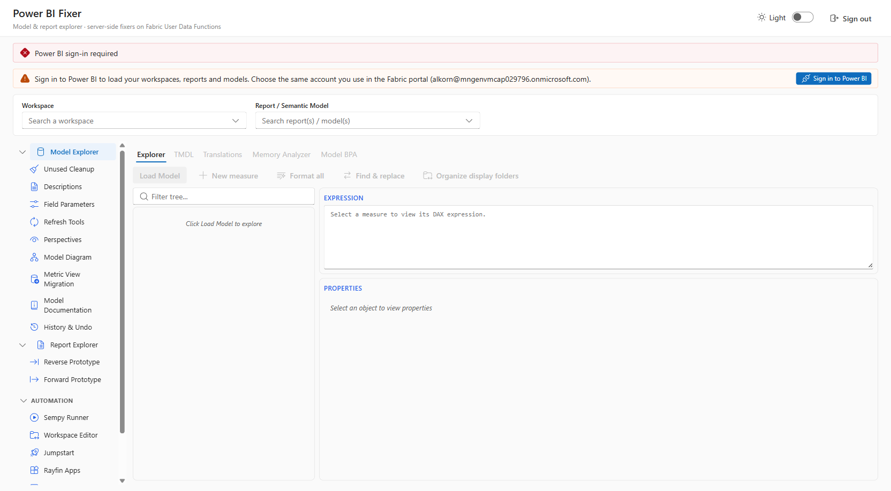
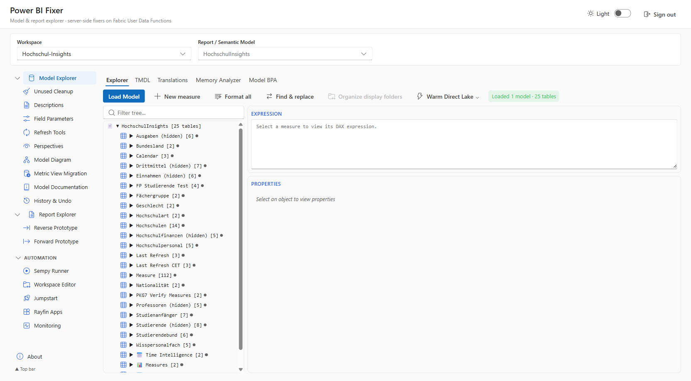
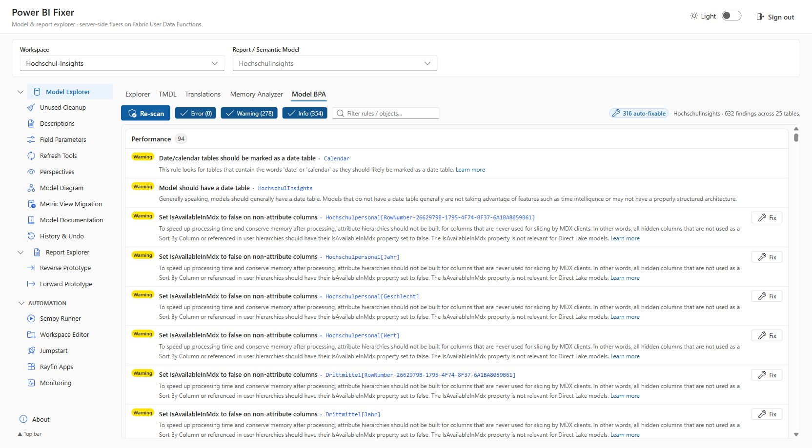
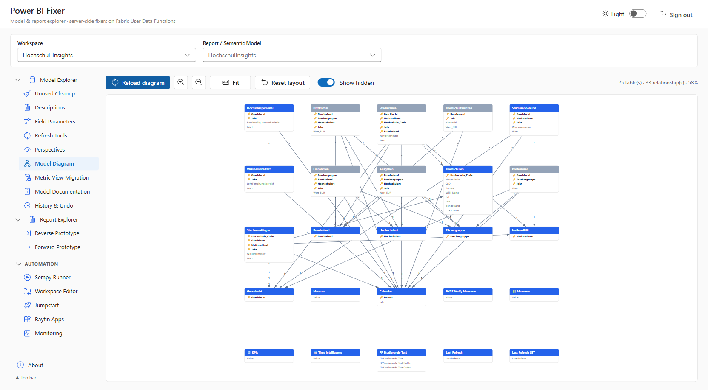
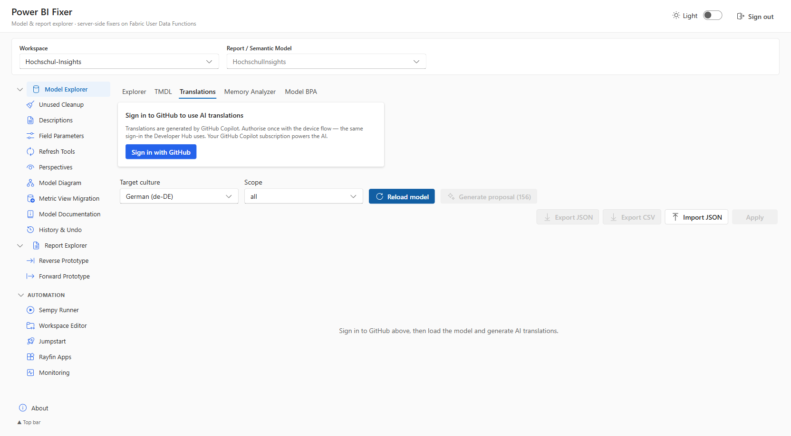

# Power BI Fixer

A Fabric-authenticated React + Vite app that **inspects, edits, and fixes Power BI
semantic models and reports** directly in the browser. It reads model and report
definitions through a server-side Fabric **User Data Function** proxy, runs a
library of Best Practice Analyzer (BPA) rules, and writes the changes back as
TMDL / PBIR — all without leaving the tab.

> Built on [Rayfin](../../README.md) — brokered Fabric auth + static hosting, so
> the whole thing runs as a single Fabric app item with a Python backend.

---

## Why this exists

If you maintain enterprise semantic models, you already know the workflow:
install a desktop model editor, connect with XMLA, click through dialogs, export
scripts, hope the diff is clean. Power BI Fixer takes a different angle — it is a
**browser-based modelling workbench** that needs nothing installed locally and
runs on top of your existing Fabric capacity.

It is built to be a genuine, everyday alternative to the established desktop
model editors:

- It **covers the core model-editing surface** people rely on from the free
  desktop editors — explore and edit tables, columns, measures, relationships,
  display folders, descriptions, perspectives, field parameters, and the raw
  TMDL.
- It **adds things you will not find even in the paid desktop tooling** — a full
  **report layer** (PBIR explorer, diff, and one-click report fixes), a **free
  IBCS-compliant custom visual**, and **AI-assisted cleanup** for translations,
  descriptions, and display-folder organisation.

No license server, no install footprint, no XMLA endpoint plumbing — just sign
in with your Fabric identity and start working.

---

## Screenshots

**The app shell** — model and report tooling, Fluent UI, light/dark themes:



**Model Explorer** — browse a Direct Lake model's tables, columns, and measures,
with inline TMDL and one-click organise actions:



**Model BPA** — the Best Practice Analyzer with per-rule findings, severity
chips, and **one-click fixes** (here: 632 findings across 25 tables, 316 of them
auto-fixable):



**Model Diagram** — a live ER diagram of tables and relationships with layout,
zoom, and hidden-object toggles:



**AI Translations** — generate culture translations for the whole model with
GitHub Copilot via a one-time device-flow sign-in:



> Screenshots use a public sample model (German higher-education statistics).

---

## Features

**Semantic model editing**

- **Model Explorer** — browse and edit tables, columns, measures, relationships; inline TMDL view.
- **Measure editing** — edit DAX with a built-in formatter, organise into display folders.
- **Unused Cleanup** — find and remove columns / measures nothing depends on.
- **Display Folders**, **Descriptions**, **Field Parameters**, **Perspectives**.
- **Model Diagram** — live ER diagram with layout, zoom, and hidden-object toggles.
- **Metric View migration**, **Model Documentation**, **Refresh Tools**.
- **History & Undo** — every write-back is tracked and reversible.

**Analysis & fixes**

- **Model BPA** — a Best Practice Analyzer rule library with severity grouping and
  **one-click fixes** for common modelling issues; batch-fix the auto-fixable findings.
- **Memory Analyzer** — column / table size and cardinality insights to shrink models.
- **Diff preview** — every fix shows the exact TMDL / PBIR change before it is written.

**Report layer** _(beyond classic model editors)_

- **Report Explorer** — PBIR tree, source / diff view, and a pop-out editor window.
- **Reverse / Forward Prototype** — scaffold and round-trip report layouts.
- **IBCS chart fixes** — bring report visuals in line with IBCS notation standards.

**Free IBCS custom visual**

- Ships with a **free, IBCS-compliant custom visual** for standardised,
  notation-correct charts — no marketplace purchase required.

**AI-assisted cleanup** _(GitHub Copilot)_

- **Translations** — generate culture translations for captions and descriptions.
- **Descriptions** — draft consistent object descriptions across the model.
- **Display-folder organisation** — propose a clean, consistent folder structure.
- All AI features authorise once via a GitHub **device flow** and run on your own
  Copilot subscription.

**Automation & ops**

- **Sempy Runner**, **Workspace Editor**, **Jumpstart catalog**, **Rayfin Apps**,
  **Workspace Monitoring** one-click deploy.

---

## Architecture

```text
┌─────────────────────────┐     brokered auth      ┌──────────────────────────┐
│  React + Vite SPA        │ ─────────────────────► │  Fabric (this app item)  │
│  (Fluent UI v9)          │                        │  static hosting + auth   │
│  src/                    │                        └──────────────────────────┘
│   ├─ explorer/ pages/    │     HTTPS invoke
│   ├─ components/         │ ─────────────────────► ┌──────────────────────────┐
│   └─ services/  ────────────── udfClient ──────►  │  Python User Data Funcs   │
│        config/udfConfig  │                        │  fabric-udf/function_app  │
└─────────────────────────┘                        │   list_workspaces         │
                                                    │   list_reports            │
                                                    │   apply_report_fixer      │
                                                    │   fabric_proxy (generic)  │
                                                    │   github_device_*/translate│
                                                    └──────────────────────────┘
```

- The SPA never calls Fabric REST directly — all calls go through the Python
  **`fabric_proxy`** UDF, which holds the on-behalf-of token server-side
  (avoids browser CORS and keeps tokens out of the client).
- Config is fully **env-driven** ([src/config/udfConfig.ts](src/config/udfConfig.ts)).
  No tenant / workspace / capacity ids are hardcoded in source.

---

## Getting started

### Prerequisites

- A **Microsoft Fabric** workspace on a capacity that supports User Data Functions.
- **Node.js 20+** and the repo's package manager.
- An **Entra app registration** (SPA) for brokered auth.
- _(Optional)_ A **GitHub Copilot** subscription for the AI cleanup tools.

### Configuration

All runtime config comes from Vite env vars. Copy `.env.example` to `.env` and
fill in your values; `rayfin env --framework vite` generates `.env.local`
(workspace / item / tenant ids + Rayfin publishable key) automatically.

| Variable | Required | Description |
|----------|----------|-------------|
| `VITE_FABRIC_TENANT_ID` | yes (from `.env.local`) | Entra tenant id (auth authority). |
| `VITE_FABRIC_SPA_CLIENT_ID` | yes | Entra SPA app-registration client id. |
| `VITE_UDF_LIST_WORKSPACES_URL` | yes | Public URL of the `list_workspaces` UDF. |
| `VITE_UDF_LIST_REPORTS_URL` | yes | Public URL of the `list_reports` UDF. |
| `VITE_UDF_APPLY_FIXER_URL` | yes | Public URL of the `apply_report_fixer` UDF. |
| `VITE_UDF_FABRIC_PROXY_URL` | no | Override for the generic proxy (derived by default). |
| `VITE_DEMO_WORKSPACE_ID` | no | Source workspace for the monitoring report clone shortcut. |

> The app derives the remaining UDF endpoints (`fabric_proxy`, `github_device_start`,
> `github_device_poll`, `github_translate`, `github_comment_m`) from
> `VITE_UDF_LIST_WORKSPACES_URL`, so you only set the three core URLs.

### Deploy your own

1. **Publish the backend functions.** Publish the Python UDF in
   [fabric-udf/](fabric-udf/function_app.py) as a **User Data Functions** item
   in your Fabric workspace (it exposes `list_workspaces`, `list_reports`,
   `apply_report_fixer`, `fabric_proxy`, and the GitHub device-flow / translate
   functions). Note the item's invoke base URL.

2. **Configure env.** Copy `.env.example` → `.env` and set
   `VITE_FABRIC_SPA_CLIENT_ID` plus the three `VITE_UDF_*_URL` values to point at
   your published UDF item.

3. **Deploy the app to Fabric:**

   ```bash
   npm run build:fabric
   npm run rayfin:up        # or: rayfin up --workspace-id <your-ws> --tenant <your-tenant> -y
   ```

   `rayfin up` provisions the app item, generates `.env.local`, and publishes the
   static bundle. The command prints the live `*.webapp.fabricapps.net` URL.

4. **(Optional) GitHub Copilot AI tools.** The Translations / Descriptions tools
   use a GitHub **device flow**: open the tool, click **Sign in with GitHub**,
   enter the shown code at <https://github.com/login/device>, and authorize. A
   Copilot subscription is required for the AI features.

### Local development

```bash
npm run dev      # rayfin env + Vite dev server at http://localhost:5173
```

Open [http://localhost:5173](http://localhost:5173) to view the app. `npm run dev`
deploys the app services to Fabric (for brokered auth) and starts a local Vite
server pointed at them.

---

## Project structure

```text
├── fabric-udf/
│   ├── function_app.py     # Python User Data Functions (proxy + fixers + GitHub flow)
│   └── requirements.txt
├── rayfin/
│   └── rayfin.yml          # Fabric service config (auth + static hosting)
├── src/
│   ├── main.tsx            # Entry point + Rayfin client bootstrap
│   ├── App.tsx             # Routes + auth gate
│   ├── config/
│   │   └── udfConfig.ts     # Env-driven UDF endpoint config
│   ├── explorer/           # Model/report explorer UI + theme
│   ├── components/         # Tool panels (BPA, Translations, Monitoring, …)
│   ├── pages/              # Top-level routed pages
│   ├── services/           # udfClient, BPA rule engines, TMDL/PBIR helpers
│   └── hooks/              # Auth context + shared hooks
├── docs/screenshots/       # README screenshots
├── .env.example            # Copy to .env and fill in
└── package.json
```

## Scripts

| Command | Description |
|---------|-------------|
| `npm run dev` | Deploy app services to Fabric and start the local dev server |
| `npm run build:fabric` | Build for Fabric deployment (`tsc -b && vite build`) |
| `npm run rayfin:up` | Deploy the app to Fabric (no local dev server) |
| `npm run lint` | Lint with ESLint |
| `npm run test` | Run unit tests with Vitest |

---

## License

[MIT](LICENSE) © Microsoft Corporation.
